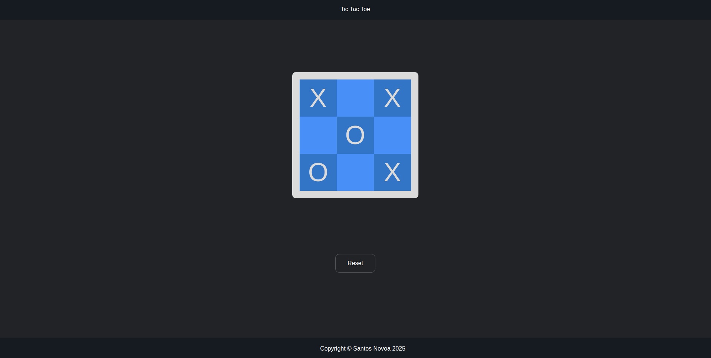

# Tic Tac Toe Game

A simple implementation of the classic Tic Tac Toe game using HTML, CSS, and JavaScript.
This was made for The Odin Project curriculum.

## Features
- Two-player game
- Tracks the turn of each player
- Displays a winner or a draw
- Highlights the winning combination with a line
- Reset button to start a new game

## Technologies Used
- HTML5
- CSS3
- JavaScript

## How to Play
1. Click on any empty square to place your marker (X or O).
2. The game alternates between Player 1 (X) and Player 2 (O).
3. The game ends when one player has three markers in a row (horizontally, vertically, or diagonally).
4. If all squares are filled and there's no winner, the game results in a draw.
5. Press the "Reset" button to start a new game.